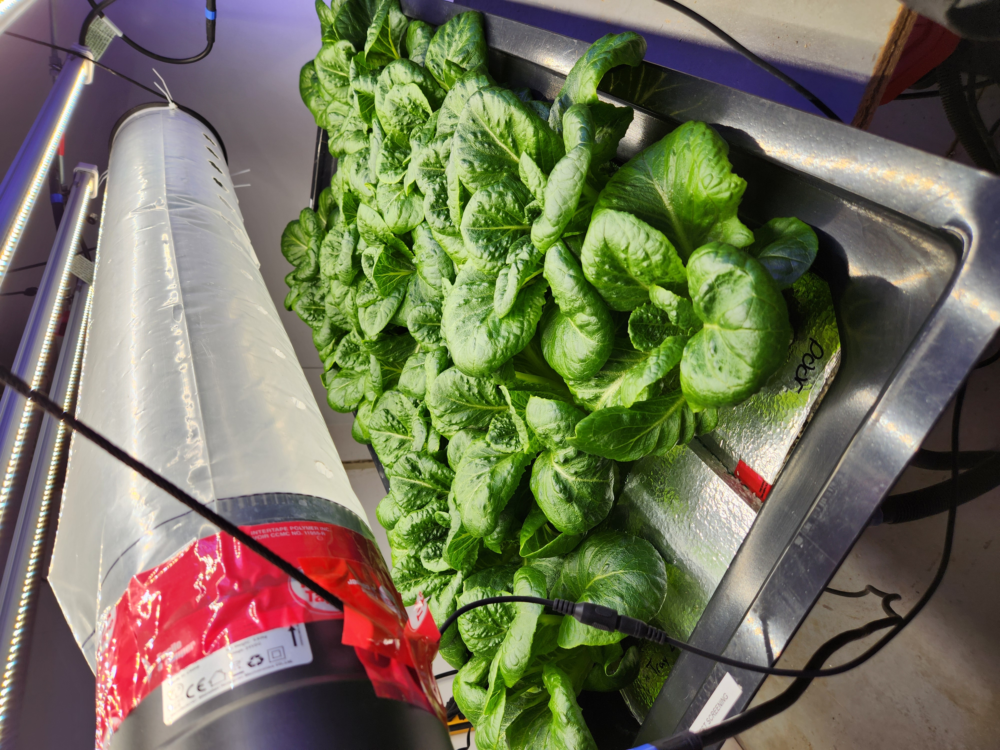
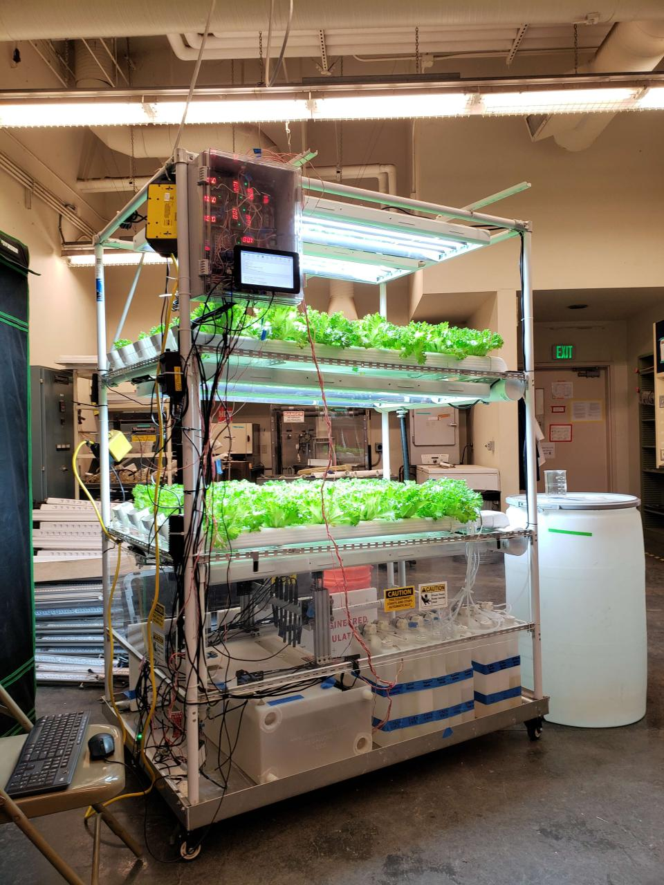
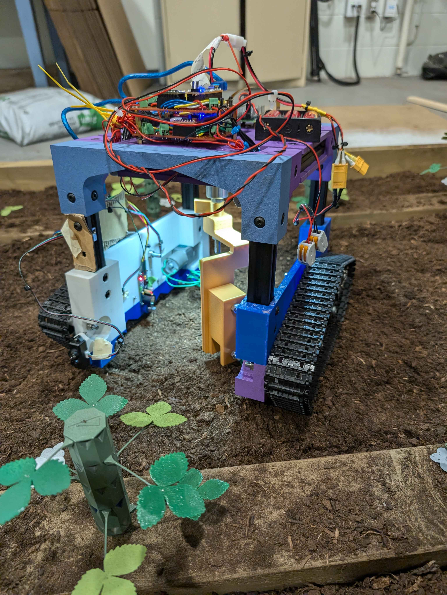
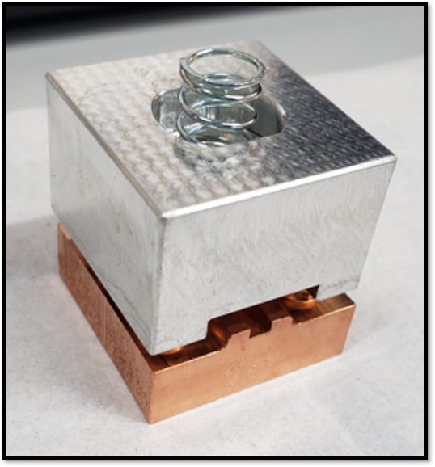
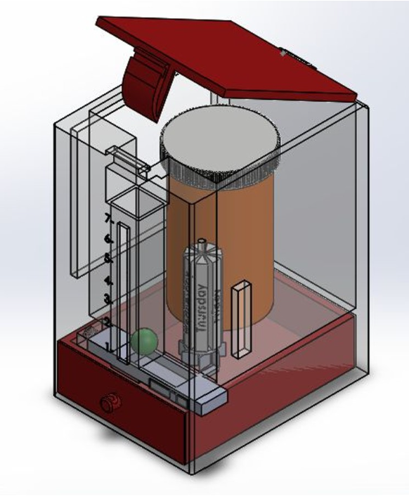

# Agricultural Engineer; EIT
Email: sangore11@gmail.com, [LinkedIn](https://www.linkedin.com/in/jordanwong3/)

## Technical Skills
- Controlled Environment Agriculture: Expertise in designing, managing, and optimizing hydroponic systems and growth chambers for plant research.
- Photosynthetic Gas Exchange: Well-versed in operating LI-6800 systems for measuring photosynthesis, transpiration, and stomatal conductance.
- CAD & 3D Design: Experienced with SolidWorks, Onshape, Solid Edge, and Fusion 360 for mechanical design and prototyping.
- Robotics & Automation: Proficient in designing, constructing, and programming autonomous systems for agricultural tasks.
- Programming Languages: Skilled in Python, MATLAB, and R for data analysis, automation, and modeling applications.
     - Libraries: pandas, ggplot, fitaci, scipy, numpy
- Technical Writing

## Education					       		
- M.S., Bioresource        Engineering	| McGill University (_August 2025_)	 			        		
- B.S., Biological Systems Engineering | University of California, Davis (_June 2023_)
- Engineer-in-Training | Board of Professional Engineers, Land Surveyors, and Geologists (_September 2025_)

## Publications/Posters/Writing
 1. Khorsandi, F., Wong, J., Araujo, G. de Moura Araujo. (2025). Is it safe for children to ride youth-sized all-terrain vehicles?. Journal of Safety Research, 94, 216-228. [https://doi.org/10.1016/j.jsr.2025.06.006](https://doi.org/10.1016/j.jsr.2025.06.006).
 2. [McGill University Thesis, August 2025](assets/Jordan_Thesis_Final.pdf)
 3. E.C Snively, M.A.K. Othman, A. Gabriel, J. Wong, A. Sy, E.A. Nanni, “Prototyping of distributed coupling accelerators at mm-wave
 frequencies.” 2022 Advanced Accelerator Concepts Workshop. 
 4. Araujo, Guilherme De Moura, Khorsandi, F., Fathallah, F., Kabakiko, S., Wong, J., "Field of Vision: How Do Youth Perceive the
 Environment When Riding Agricultural All-Terrain Vehicles?" 2022 ASABE Annual International Meeting. American
 Society of Agricultural and Biological Engineers, 2022.
 5. Wong, J., Malikzada, F., Butcher, R., Buddhamatya, N., “Part Preparation and Cable Routing within a CubeSat”, 32nd Annual
 Undergraduate Research Conference. University of California, Davis, 2021.

## Controlled Environment Research
**Biomass Production Lab, Optimizing Lettuce Growth in Controlled High-Humidity Environments, Montréal, Québec** *(September 2023 - August 2025)*
- Led a study on the effects of light spectrum and air velocity on tipburn occurrence in hydroponically grown lettuce under elevated humidity conditions (>70% relative humidity) (results to be published).
- Designed, built, and optimized controlled-environment plant growth chambers to automatically regulate temperature, humidity, and CO₂ concentration within ±5% of set values.
- Coordinated scheduling of environmental control, irrigation systems, and plant nutrition programs throughout two years of full thirty day growth cycles of romaine lettuce.
- Conducted pest/disease monitoring and implemented corrective actions as needed.
- Developed rigorous phenotypical and chemical standard operating procedures (SOPs) to characterize 16 different plant response traits and for growth room operation.
- Applied a data-driven approach using R and Python to optimize crop production and evaluate plant responses through statistical analysis.

**Automated Nutrient Management System for Hydroponics, Davis, California** *(September 2022 - June 2023)*
- Designed, fabricated, and tested an automated nutrient management system for a recirculating hydroponic setup, maintaining nutrient concentrations within ±5% of user-defined setpoints.
- Adapted an off-the-shelf linear actuator system to create a two-axis linear motion system to support autonomous measurements using an array of nutrient sensors.
- Validated system by growing romaine lettuce to confirm accurate maintenance of macronutrient levels and plant response.
- [View the final poster](assets/final_poster.png)

## Prior Research Experience
**Research Assistant, Improving Child Safety in ATVs, Safe Ag Lab, Davis, California** *(April 2021 - September 2023)*
- Co-authored a study assessing the suitability of child-sized all-terrain vehicles (ATVs) for children.
- Employed pandas library in Python to analyze large datasets, including field of vision, anthropometry, and strength measurements to comprehensively evaluate the suitability of child-sized all-terrain vehicles (ATVs) for children.
- Developed accurate 3D models of ATVs in SolidWorks, integrating virtual reality software and mechanical measurements. 
- Performed simulations in SAMMIE CAD to ensure simulated child subjects met all anthropometric requirements for effective ATV operation.

**Research Intern, mm-wave Tuning Device, SLAC National Accelerator Laboratory, Menlo Park, California** *(June 2022 - August 2022)*
- Designed an intuitive and adjustable device to tune mm-wave structures for the development of high frequency medical accelerators used in radiotherapy.
- Utilized image processing techniques to characterize performance of the tuning device on mm-wave structures. 
- Validated the tuning device by correlating different types of impressions to specific resonant frequency shifts using MATLAB.
- [2022 SULI Oral Presentation - mm-Wave Cavity Design](https://www.youtube.com/watch?v=b_AH3uw2jWA&ab_channel=JordanWong)

## Projects

**ASABE Student Robotics Competition - OEUF** *(July 2025)*
- Designed, constructed, and tested a robotic system for autonomous egg collection and sorting in a simulated environment.
- Implemented autonomous movement and control of the robot using Robotic Operating Software 2 (ROS2)
- Supervised development of the various subsystems for the collection, sorting, and unloading of eggs

**ASABE Student Robotics Competition - BERR-E** *(July 2024)*
- Designed, constructed, and tested a robotic system for autonomous strawberry leaf trimming in a simulated environment.
- Programmed and optimized the function of individual actuators in arduino and python to ensure precise and reliable motion control.
- Developed and implemented control logic for autonomous movement using Node-RED.
- Conducted rigorous performance testing to validate system functionality.
- [View the final poster](assets/berre_poster.pdf)

**Space and Satellite Systems** *(September 2021 - June 2023)*
- Managed project timelines and budgets, ensuring alignment with NASA requirements and deliverables.
- Authored Verification & Validation (V&V) and Interface Control Documents (ICDs) to guarantee quality assurance and integration of satellite components.
- Collaborated on satellite manufacturing, prototyping, and assembly, maintaining thorough process documentation.
- Presented project progress at the 2021 UC Davis Undergraduate Research Conference, representing the Parts Preparation and Cable Harnessing team.
     - [URC Poster](assets/parts_prep.png)

**L'SPACE Mission Concept Academy** *(January 2022 - May 2022)*
- Coauthored a Preliminary Design Review structured around utilizing the volatiles present in the regolith of the Permanently Shadowed Regions (PSRs) on the Moon
- Planned the science mission and payload instrumentation to find and characterize polar volatiles within the area surrounding the Amundsen crater
- [Final PDR](assets/pdr.pdf)

**7th Annual Biomedical Engineering Society Make-a-thon** *(January 2021)*
- Collaborated with a team of 6 to design a winning medical device to keep track of medication dosing using a gumball-like mechanism, incorporating both manufacturability and functionality. 
- Designed the walls in Solidworks to interface using a Lego-type design, facilitating ease of manufacturability and assembly.
- Incorporated a dial mechanism in Solidworks to track days of the week upon each daily use of the device. 

## Awards
- **Fonds de recherche du Québec - Nature et technologies, Master’s Training Scholarships Recipient** *(2023)*
- **American Society of Agricultural and Biological Engineers, 2024 Annual International Meeting Student Presentation Award** *(2024)*
- **American Society of Agricultural and Biological Engineers, 2025 Annual International Meeting Student Presentation Award** *(2025)*

## Gallery
**Optimizing Lettuce Growth in Controlled High-Humidity Environments**
<table>
  <tr>
    <td></td>
  </tr>
</table>

**Automated Nutrient Management System**
<table>
  <tr>
    <td></td>
  </tr>
</table>

**ASABE Student Robotics Competition 2024 - BERR-E**
<table>
  <tr>
    <td></td>
  </tr>
</table>

**ASABE Student Robotics Competition 2025 - OEUF**
<table>
  <tr>
    <td></td>
  </tr>
</table>

**mm-wave Tuning Device**
<table>
  <tr>
    <td></td>
  </tr>
</table>

**7th Annual Biomedical Engineering Society Make-a-thon**
<table>
  <tr>
    <td></td>
  </tr>
</table>
